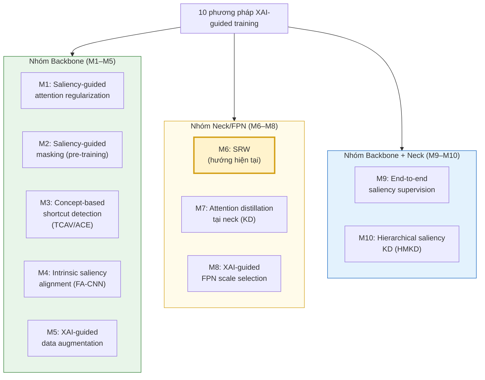
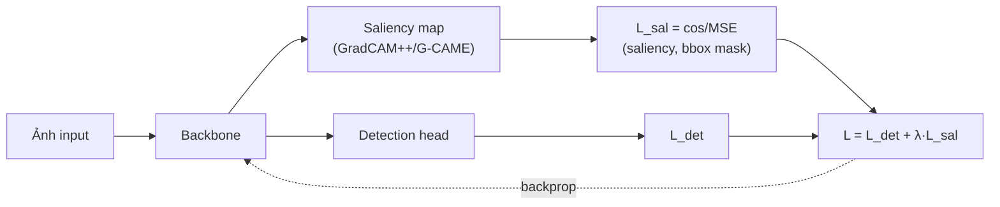
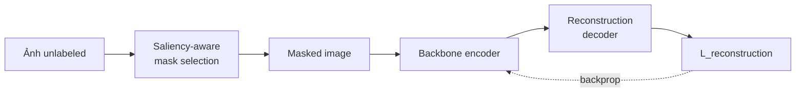
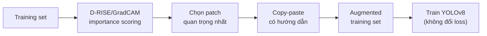
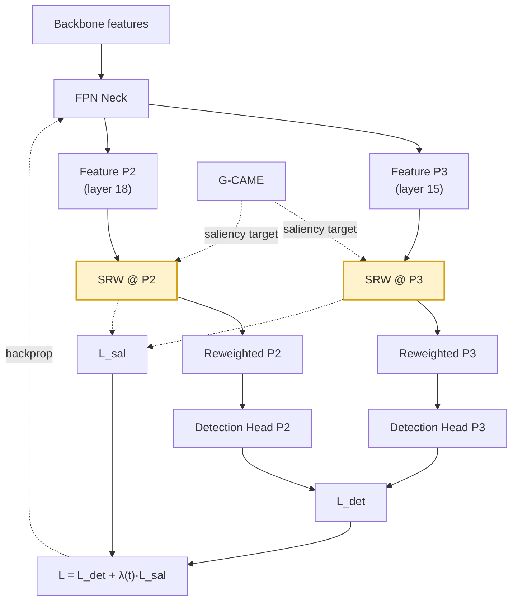
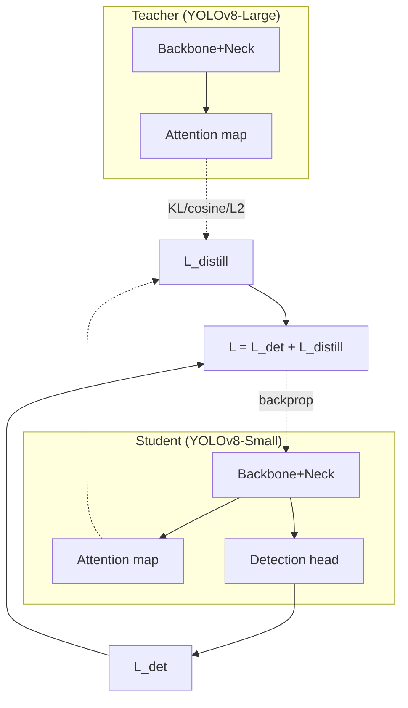
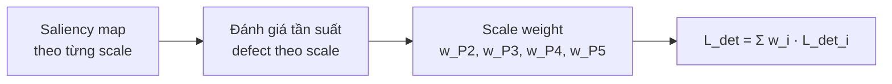
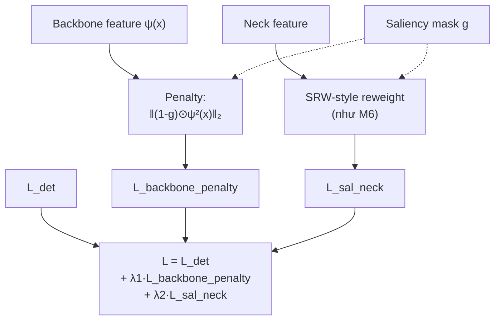
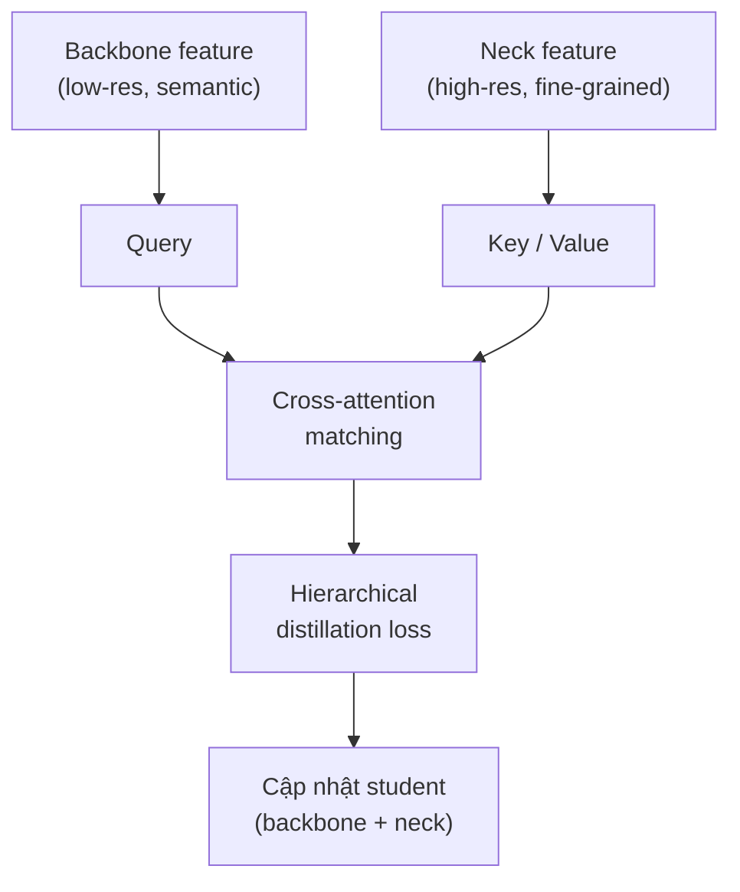

# 10 Phương pháp Can thiệp XAI cho YOLOv8 — Sơ đồ Pipeline và Giải thích Chi tiết

Tài liệu này trình bày đầy đủ **10 phương pháp** can thiệp XAI vào quá trình huấn luyện YOLOv8 cho bài toán phát hiện defect trên drill bit (ảnh grayscale, 4 lớp defect, bounding box chủ yếu rất nhỏ), phân nhóm theo vị trí can thiệp: **Backbone (M1–M5)**, **Neck/FPN (M6–M8)**, và **Backbone + Neck kết hợp (M9–M10)**.

---

## 0. Sơ đồ phân loại tổng thể

**Cách đọc bảng phân loại:** trục phân nhóm là *vị trí can thiệp trong kiến trúc* (backbone trích xuất feature thô → neck hợp nhất đa tỉ lệ → head dự đoán). Vị trí can thiệp càng gần backbone, ảnh hưởng càng "gốc rễ" nhưng khó kiểm soát; càng gần neck/head, ảnh hưởng càng cục bộ nhưng dễ tune và rẻ hơn về compute.

---

## Nhóm Backbone (M1–M5)

### M1 · Saliency-guided attention regularization

**Cơ chế:** Sinh saliency map (GradCAM++, G-CAME, hoặc GradCAM) từ backbone tại mỗi bước train, dùng cosine similarity hoặc MSE giữa saliency map và ground-truth bbox mask làm auxiliary loss `L_sal`.

**Công thức:** `L = L_det + λ · L_sal`, với `L_sal` đo khoảng cách giữa saliency map và mask nhị phân của ground-truth bbox.

**Ưu điểm:** Gradient đi trực tiếp vào các layer sâu nhất của backbone — ảnh hưởng "tận gốc" đến cách trích xuất feature.
**Nhược điểm:** Đây là phương pháp **gần nhất với SRW** nhưng đặt sai vị trí (backbone thay vì neck) cho bài toán tiny object — feature ở backbone chưa qua multi-scale fusion nên khó alignment chính xác với object cực nhỏ.
**Liên hệ với SRW:** Có thể xem là "phiên bản backbone" của SRW; là cơ sở lý thuyết cho phần mở rộng M9.

---

### M2 · Saliency-guided masking cho self-supervised pre-training

**Cơ chế:** Thay vì random masking (như MAE), dùng saliency map để chọn vùng cần mask trong giai đoạn pre-train backbone.

**Ý tưởng cốt lõi:** Random masking (MAE chuẩn) có rủi ro che hoàn toàn một small object, buộc model phải "hallucinate" — gây nhiễu loạn cho domain có nhiều tiny object như drill bit defect. Saliency-aware masking tránh che hoàn toàn vùng quan trọng, giữ lại một phần tín hiệu defect luôn hiện diện.

**Ưu điểm:** Phù hợp làm bước **fine-tune backbone trước khi gắn FPN neck** (giai đoạn pre-training riêng).
**Nhược điểm:** Cần dữ liệu pre-training quy mô lớn hơn fine-tuning thông thường; tốn thêm một giai đoạn huấn luyện độc lập trước khi vào pipeline chính — không tương thích trực tiếp với SRW (SRW là can thiệp ở supervised training, không phải pre-training).

---

### M3 · Concept-based shortcut detection (TCAV/ACE)

**Cơ chế:** Dùng TCAV (Testing with Concept Activation Vectors) hoặc ACE (Automated Concept Extraction) để phát hiện xem backbone có học các "spurious concept" không liên quan đến defect (vân nền kim loại, vết dầu, phản chiếu ánh sáng...) hay không, sau đó thêm penalty loss để đẩy các concept đó ra khỏi representation.

**Quy trình:**
1. Thu thập tập ảnh mẫu cho từng concept nghi ngờ là shortcut (ví dụ: "vân kim loại", "vết dầu").
2. Tính concept activation vector (CAV) cho mỗi concept tại một layer backbone.
3. Đo TCAV score — mức độ activation của layer đó nhạy với concept.
4. Nếu TCAV score cao bất thường với concept không liên quan đến defect → thêm penalty loss đẩy gradient ra xa hướng concept đó.

**Ưu điểm:** Hướng ít được khai thác trong defect detection, novelty cao; giải quyết trực diện vấn đề shortcut learning — rất phù hợp về mặt lý thuyết với domain công nghiệp có nhiều artifact bề mặt dễ gây nhầm lẫn.
**Nhược điểm:** Computational cost lớn vì cần xây tập concept mẫu thủ công (gán nhãn concept riêng biệt với nhãn defect), và việc xác định concept nào là "spurious" mang tính chủ quan, khó tự động hóa hoàn toàn.

---

### M4 · Intrinsic saliency alignment (FA-CNN style)

**Cơ chế:** Thiết kế lại backbone sao cho feature map tại penultimate layer về mặt lý thuyết tương đương với GradCAM saliency map — tức là mô hình **intrinsically interpretable**, không cần chạy post-hoc XAI sau khi train.

**Cách triển khai:** Thêm constraint vào C2f block để gradient flow theo hướng nhất quán với class activation map (CAM), ép buộc cấu trúc nội tại của feature cuối backbone đã mang tính giải thích được.

**Ưu điểm:** Phù hợp nếu mục tiêu publish là hướng "interpretable by design" — một XAI paradigm khác hẳn so với post-hoc explanation; loại bỏ chi phí tính saliency riêng biệt ở inference time.
**Nhược điểm:** Đòi hỏi sửa đổi kiến trúc backbone sâu (architecture-level change), rủi ro làm giảm độ chính xác detection nếu constraint quá chặt; khó tách biệt đóng góp của riêng XAI component trong ablation vì nó hòa lẫn vào kiến trúc.

---

### M5 · XAI-guided data augmentation

**Cơ chế:** Dùng D-RISE hoặc GradCAM để xác định vùng defect "quan trọng" nhất trong training set, sau đó ưu tiên copy-paste các patch đó (thay vì random) sang ảnh khác.

**Điểm khác biệt so với các phương pháp khác:** M5 không thay đổi loss function hay kiến trúc — XAI chỉ tác động ở **giai đoạn tiền xử lý dữ liệu**, hoàn toàn tách biệt khỏi vòng lặp training.

**Ưu điểm:** Chiến lược selective small object copy-paste đã được chứng minh hiệu quả cho small object training trong literature; dễ triển khai, không cần sửa kiến trúc hay loss, có thể kết hợp song song với bất kỳ phương pháp nào khác (kể cả SRW) mà không xung đột.
**Nhược điểm:** Tác động gián tiếp hơn — không đảm bảo model thực sự học "nhìn đúng chỗ" trong quá trình tối ưu, chỉ tăng tần suất xuất hiện của vùng quan trọng.

---

## Nhóm Neck / FPN (M6–M8)

### M6 · Saliency Reweighting Module — SRW (hướng hiện tại)

**Cơ chế:** Chèn SRW module vào FPN neck, dùng G-CAME để sinh channel/spatial importance weights, reweight feature map tại từng scale (P2/P3 trong cấu hình `yolov8-p2.yaml`) theo saliency.

**Công thức:** `L = L_det + λ(t)·L_sal`, với `λ(t)` theo cosine decay schedule.

**Ưu điểm:** Can thiệp ở neck — nơi multi-scale fusion xảy ra — rất phù hợp với tiny object detection vì P2/P3 là các scale quan trọng nhất cho object < 32×32 px; module nhẹ, dễ tích hợp vào pipeline YOLOv8 hiện có mà không cần sửa backbone.
**Nhược điểm:** Phụ thuộc chất lượng saliency map G-CAME — nếu G-CAME sinh map nhiễu ở giai đoạn đầu training (khi model chưa hội tụ), `L_sal` có thể dẫn sai hướng; cần cosine decay để giảm dần ảnh hưởng này.

*(Xem tài liệu trước đó "SRW_pipeline_and_explanation.md" để có chi tiết đầy đủ về kiến trúc nội bộ, ablation study 4 điều kiện, và lịch trình λ(t).)*

---

### M7 · Attention distillation tại neck (Knowledge Distillation)

**Cơ chế:** Dùng saliency/attention map của teacher model làm signal hướng dẫn student FPN neck học feature reweighting, qua attention-weighted feature distillation loss.

**Điểm khác biệt then chốt so với M6:** supervision đến từ **teacher model** (ví dụ YOLOv8-Large làm teacher, YOLOv8-Small làm student) thay vì từ XAI map độc lập như G-CAME. Các loss phân phối như KL-divergence, cosine similarity, hoặc L2 được áp dụng giữa attention map của teacher và student, kết hợp với task loss tổng thể.

**Ưu điểm:** Tận dụng được model lớn đã train tốt để "dạy" model nhỏ — phù hợp nếu mục tiêu là model nén (compression) cho deployment công nghiệp.
**Nhược điểm:** Cần huấn luyện/sở hữu sẵn một teacher model chất lượng cao — chi phí compute gấp đôi (train teacher + train student); không trực tiếp dùng XAI ground-truth mà dùng attention "tự nhiên" của teacher, có thể kế thừa cả bias của teacher.

---

### M8 · XAI-guided FPN scale selection

**Cơ chế:** Thay vì treat P2/P3/P4/P5 đồng đều, dùng saliency map để đánh giá defect xuất hiện nhiều nhất ở scale nào, rồi động thái reweight contribution của từng FPN level trong training.

**Cơ sở dữ liệu hỗ trợ:** Phân tích cho thấy với tiny object (dưới 32×32 px), P2 và P3 là scale phục vụ chính — việc phân bổ tài nguyên không đúng làm loãng tín hiệu phân biệt giữa các lớp defect.

**Ưu điểm:** XAI giúp việc phân bổ trọng số giữa các scale dựa trên data thay vì heuristic cố định; chi phí triển khai thấp (chỉ thêm trọng số vào loss có sẵn, không cần module mới).
**Nhược điểm:** Đây là can thiệp ở mức **loss weighting**, không thay đổi cách feature được học bên trong từng scale — yếu hơn SRW về mặt "định hướng nhìn đúng chỗ" trong không gian feature; phù hợp làm baseline so sánh hơn là phương pháp chính.

---

## Nhóm Backbone + Neck kết hợp (M9–M10)

### M9 · End-to-end saliency supervision loss

**Cơ chế:** Regularize feature map trung gian bằng cách minimize L2-norm của activation tại các vùng không được saliency map highlight, tức phạt mạnh feature nằm ngoài vùng đối tượng.

**Công thức:** `L = L_det + λ‖(1 − g) ⊙ ψ²(x)‖₂`

trong đó `g` là saliency mask, `ψ(x)` là feature activation, `⊙` là phép nhân element-wise.

**Áp dụng đồng thời ở cả backbone (feature extraction) và neck (feature fusion)**, giúp toàn bộ pipeline học "nhìn đúng chỗ" xuyên suốt — đây chính là phương pháp được đề xuất làm hướng **mở rộng SRW** (kết hợp M6+M9) để tăng novelty.

**Ưu điểm:** Bao phủ toàn bộ pipeline (end-to-end), tạo thêm một trục ablation tự nhiên (có/không có backbone penalty).
**Nhược điểm:** Hai số hạng phạt cần tune riêng (`λ1`, `λ2`), tăng độ phức tạp hyperparameter search; rủi ro over-regularization nếu cả backbone và neck đều bị ép quá mạnh theo cùng một saliency mask.

---

### M10 · Hierarchical saliency knowledge distillation (HMKD)

**Cơ chế:** Dùng cross-level hierarchical matching — high-level semantic từ backbone (low resolution) làm **query**, fine-grained feature từ neck (high resolution) làm **key-value**, rồi update student thông qua attention-weighted distillation loss.

**Vấn đề cốt lõi được giải quyết:** Mismatch giữa semantic richness (cao ở backbone sâu, nhưng độ phân giải thấp) và spatial resolution (cao ở neck/feature nông, nhưng ngữ nghĩa yếu hơn) — đây chính là vấn đề lõi của tiny object detection, vì semantic mạnh cần thiết để phân loại defect đúng lớp, còn resolution cao cần thiết để định vị chính xác bounding box nhỏ.

**Ưu điểm:** Đây là phương pháp tinh tế nhất trong 10 phương pháp về mặt lý thuyết — giải quyết trực diện trade-off semantic/resolution thay vì chỉ reweight đơn thuần.
**Nhược điểm:** Phức tạp nhất để triển khai (cần cross-attention module, cơ chế matching giữa các level), chi phí compute cao nhất trong nhóm; cần teacher model như M7, kế thừa luôn nhược điểm về chi phí train hai mô hình.

---

## Bảng so sánh tổng hợp

| # | Phương pháp | Vị trí | Cần teacher? | Độ phức tạp triển khai | Mức độ liên quan trực tiếp đến SRW |
|---|---|---|:---:|:---:|---|
| M1 | Saliency-guided attention reg. | Backbone | Không | Thấp | Cao — "phiên bản backbone" của SRW |
| M2 | Saliency-guided masking (pretrain) | Backbone | Không | Trung bình | Thấp — khác giai đoạn (pretrain) |
| M3 | Concept-based shortcut (TCAV/ACE) | Backbone | Không | Cao | Thấp — hướng bổ sung độc lập |
| M4 | Intrinsic saliency alignment | Backbone | Không | Cao (kiến trúc) | Thấp — paradigm khác (intrinsic) |
| M5 | XAI-guided data augmentation | Tiền xử lý dữ liệu | Không | Thấp | Trung bình — có thể kết hợp song song |
| **M6** | **SRW (hướng hiện tại)** | **Neck/FPN** | **Không** | **Trung bình** | **— (chính nó)** |
| M7 | Attention distillation tại neck | Neck/FPN | **Có** | Cao | Trung bình — cùng vị trí, khác nguồn signal |
| M8 | XAI-guided FPN scale selection | Neck/FPN (loss-level) | Không | Thấp | Trung bình — bổ trợ tốt cho SRW |
| M9 | End-to-end saliency supervision | Backbone + Neck | Không | Trung bình–Cao | **Cao — hướng mở rộng SRW** |
| M10 | Hierarchical saliency KD (HMKD) | Backbone + Neck | **Có** | Rất cao | Thấp–Trung bình |

---

## Gợi ý định vị

Với hướng nghiên cứu hiện tại (M6/SRW), điểm phân biệt mạnh nhất so với M7 và M10 là: SRW dùng **XAI làm training signal chủ động** (G-CAME, tính trực tiếp trong vòng lặp train) thay vì dùng teacher model như M7/M10 — tránh được chi phí train hai mô hình song song.

Hai hướng mở rộng tự nhiên nhất nếu cần tăng novelty hoặc làm phong phú phần ablation/contribution phụ:

1. **M6 + M9**: thêm saliency penalty ở backbone bên cạnh SRW ở neck, tạo framework hai tầng xuyên suốt pipeline.
2. **M6 + M8**: kết hợp SRW (reweight feature nội tại) với scale selection ở mức loss-weighting — chi phí thấp, dễ thêm như một ablation bổ sung mà không cần sửa kiến trúc nhiều.

M2, M3, M4, M7, M10 phù hợp hơn để **đề cập trong phần Related Work** như các hướng đã được khám phá hoặc các paradigm thay thế, thay vì tích hợp trực tiếp vào pipeline SRW hiện tại — vì chúng hoặc khác giai đoạn huấn luyện (M2), đòi hỏi infrastructure khác (M3, M7, M10), hoặc thuộc paradigm thiết kế khác (M4).
